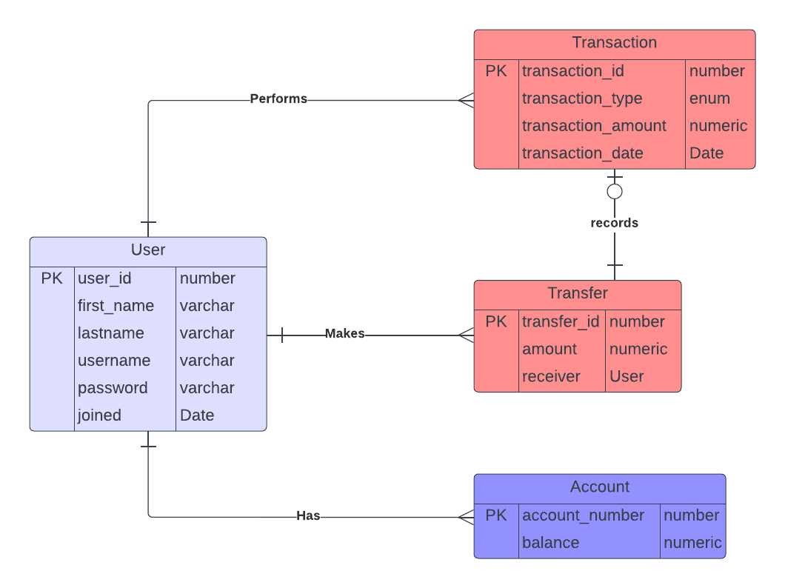

# TypeScript Backend Engineering Challenge for Lendsqr

## Important Note

I was unable to complete the challenge due to a bug in the selected `typeorm` ORM mandated by the challenge.
The bug affected the querying of the database outside of the initial initialization block

I checked this extensively to ensure that the problem wasn't from my end.
This included use autogenerated project by the typeorm cli. The issue persisted

I tried proposed workarounds on typeorm's github issues page. None worked.

Here's a link to the issue on github issue [here](https://github.com/typeorm/typeorm/issues/9154) where it is labelled a bug

#### Error Output:

`
C:\Users\user\code\interview\lendsqr\node_modules\src\data-source\DataSource.ts:427
        if (!metadata) throw new EntityMetadataNotFoundError(target)
                             ^
EntityMetadataNotFoundError: No metadata for "User" was found.
    at DataSource.getMetadata (C:\Users\user\code\interview\lendsqr\node_modules\src\data-source\DataSource.ts:427:30)
    at Repository.get metadata [as metadata] (C:\Users\user\code\interview\lendsqr\node_modules\src\repository\Repository.ts:52:40)
    at Repository.save (C:\Users\user\code\interview\lendsqr\node_modules\src\repository\Repository.ts:205:18)
    at Object.<anonymous> (C:\Users\user\code\interview\lendsqr\src\entity\db.init.ts:55:14)
    at Module._compile (node:internal/modules/cjs/loader:1126:14)
    at Module.m._compile (C:\Users\user\code\interview\lendsqr\node_modules\ts-node\src\index.ts:1618:23)
    at Module._extensions..js (node:internal/modules/cjs/loader:1180:10)
    at Object.require.extensions.<computed> [as .ts] (C:\Users\user\code\interview\lendsqr\node_modules\ts-node\src\index.ts:1621:12)
    at Module.load (node:internal/modules/cjs/loader:1004:32)
    at Function.Module._load (node:internal/modules/cjs/loader:839:12)
`

## End Note

## Task

I did, however, implement the project  (At least the logic of it).\
I hope that is acceptable enough.

The layout of the code:

`

    Lendsqr

    |
    |--- src
    |    |--- controllers                  // Controllers are implemented here
    |    |    |___ user.controller.ts      // user related controllers
    |    |    |___ account.controller.ts   // account related controllers
    |    |      
    |    |--- entity                       // basically the database
    |    |    |___ user.entity.ts          // user entity/table
    |    |    |___ account.entity.ts       // account entity/table -- Not used due to DB issue. Tried to keep things simple while debugging
    |    |    |___ transaction.entity.ts   // transaction entity/table
    |    |    |___ transfer.entity.ts      // transfer entity/table -- It isn't used
    |    |    |___ queries.ts              // query handler functions
    |    |    |___ db.config.ts            // database config file
    |    |    |___ db.init.ts              // database initialisation file -- PS: where it all went wrong
    |    |
    |    |
    |    |--- middleware
    |    |    |___ middleware.ts           // routing middleware
    |    |
    |    |--- routes
    |    |    |___ index.ts                // route entry point
    |    |    |___ user.routes.ts          // user routes handler
    |    |    |___ account.routes.ts       // account transactions route handler
    |    |
    |    |--- types
    |    |    |___ index.d.ts
    |    |
    |    |--- utils                        // Some utilities
    |    |    |___ get_fee.ts              // get the transaction fee
    |    |    |___ hash.ts                 // hash function
    |    |
    |    |___ index.ts                     // Program entry point
    |    |___ server.ts                    // Server definition
    |
    |--- tests
    |    
    |___ package.json
    |___ README.md <You are Here>
    |___ tsconfig.json
    |___ yarn.lock
`

### ER Diagram

<!--  -->

<figure>
    
    <figcaption>ERD</figcaption>
</figure>

The database is normalized

Spent too much time chasing shadows with the DB, couldn't write the tests 😪
